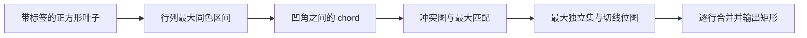

# 从像素到最少矩形

[返回 README](../README.md) · 下一篇：[实现与优化](matching.md)

## 1. 要解决什么问题

把每个像素看作一个单位正方形。相同标签的正方形组成区域，我们要用尽量少的轴对齐矩形把区域分完：不遗漏、不混色、不重叠。矩形可以共享边界，允许 T 形接缝。

例如 `A` 是一种颜色、`.` 是背景：

```text
输入              一种最优划分
.A.               .1.
AAA               213
.A.               .1.
```

右侧的 `1`、`2`、`3` 是矩形编号，实际输出的颜色仍全部为 `A`。中间竖条与左右两个单像素共三个矩形。

颜色之间可以独立求解，因为一个合法矩形不能包含两种颜色。同色但只在角点接触的像素也不能因此合成一个矩形。代码直接处理像素区间，无需先追踪多边形轮廓、连通分量或孔洞。

## 2. 凹角是需要消除的障碍

矩形只有四个凸角。一个区域向内凹进去的角称为**凹角**（reflex vertex），内部角度为 270°；若最终每块都是矩形，每个凹角都必须被某条分割线处理。

在像素网格上，检查一个格点周围的四个像素即可判断：对于某个标签，恰有三个像素属于它，就形成这个标签的凹角。例如：

```text
A A
A .
```

四个像素之间的格点是凹角。这里的角在像素边界上，不在像素中心。

从凹角向区域内部延伸一条水平或竖直线，可以消除这个凹角。如果这条线恰好连接另一个凹角，就能同时处理两个凹角，这种线段特别有价值。

## 3. Chord：一次处理两个凹角

本文把**连接两个凹角、且开放线段位于同色区域内部的水平或竖直线段**称为 chord（弦）。它只是候选切线，尚未决定是否采用。

Chords 不能随意全部选取。两条相交的 chord 会干扰“每个凹角只处理一次”的计数；共享凹角端点也属于冲突。候选线段之间有两种不同的约束：

- 同向 chord 不相交：每个凹角沿同一轴只支持一个向内方向，一个端点不能被两条同向 chord 使用；凹角位于区域边界，也不可能落在另一条 chord 的内部。
- 水平与竖直 chord 可能相交，包括端点相交；必须从中取舍。

因此，需要选择的是**数量最多的互不冲突 chord**，不是最长的线段，也不是随便一个无法继续增加线段的集合。

经典矩形分解结果把这一选择归约为图问题：[Ferrari、Sankar、Sklansky（1984）](https://doi.org/10.1016/0734-189X(84)90139-7) 给出了数字区域最少矩形划分与二分图独立集之间的联系。

在无孔、边界无点接触退化的单个正交多边形中，若有 `r` 个凹角，最多能选 `g` 条不相交 chord，则最少矩形数为 `r + 1 - g`。这说明每增加一条可共存的 chord，就能少切一块；相关构造可见 [Liou、Tan、Lee（1990）第 II 节](https://ir.lib.nycu.edu.tw/bitstream/11536/4064/1/A1990DL35300004.pdf)。含孔数字区域也适用 chord 与匹配归约；代码不靠上述无孔计数公式求答案，而是构造并输出划分。研究更一般的退化孔洞时，应核对 [文献中的区域定义](references.md)。

## 4. 为什么是二分图

构造冲突图 `G = (H ∪ V, E)`：

| 图中的对象 | 几何意义 |
| --- | --- |
| 左侧顶点 `H` | 水平 chord |
| 右侧顶点 `V` | 竖直 chord |
| 边 `E` | 一条水平 chord 与一条竖直 chord 相交 |

因为同向 chord 不相交，边只会跨越左右两侧，这就是**二分图**。互不冲突的 chord 集合对应**独立集**：集合内任意两个顶点之间都没有边。

开头的十字形恰有两条水平和两条竖直 chord。每条水平 chord 都与两条竖直 chord 在端点处冲突，所以每个左顶点都连接每个右顶点，这个图记为 `K₂,₂`。最多保留两条 chord；选择两条竖直 chord，就得到图示的三个矩形。

这里必须保留端点冲突。如果只检查线段内部的十字交叉，就会错误地认为上述四条 chord 可以同时选取。

## 5. 从最大匹配得到最大独立集

**匹配**是一组不共享顶点的边。最大匹配 `M` 的边数最多，但它不是最终要选的 chord；它帮助计算冲突图的最大独立集。

**顶点覆盖**是一组顶点，使每条边至少有一个端点在其中。独立集与顶点覆盖互为补集。Kőnig 定理指出，二分图的最小顶点覆盖大小等于最大匹配大小，因此：

```text
最大独立集大小 = |H| + |V| - |M|
```

求出匹配后，从未匹配的水平顶点出发，沿“未匹配边向右、匹配边向左”遍历，得到可达集合 `Z`：

```text
最小顶点覆盖 = (H \ Z) ∪ (V ∩ Z)
最大独立集   = (H ∩ Z) ∪ (V \ Z)
```

其中 `H ∩ Z` 是可达的水平顶点，`V \ Z` 是不可达的竖直顶点。代码保留这两部分 chord。匹配与覆盖的等大关系也提供了一个可验证的最优性证书。最大匹配的求解方式见 [HKDW 实现](matching.md)。

## 6. 从选中的 chord 输出矩形

选中 chord 后，还需要处理未被 chord 配对的凹角。经典构造从这些凹角继续延伸切线，直到遇到区域边界或已有切线。本实现把这个过程放进逐行扫描，不构建显式多边形：

1. 将选中的水平、竖直 chord 分别写成切线位图。
2. 每行的同色区间遇到竖直切线时分段，形成若干连续段（run）。
3. 当前 run 与上一行活跃矩形的颜色和横向范围完全相同，且中间没有水平切线时，继续向下延伸。
4. 不能继续的矩形立即输出；新出现的 run 成为新的活跃矩形。

竖直 chord 提供横向分段边界，水平 chord 阻止跨行合并；形状变化处停止延伸，自然产生剩余分割边。这一步必须和 chord 选择一起验证，不能只证明图匹配正确就认为最终划分必然正确。



接下来阅读 [实现与优化](matching.md)，把这些对象对应到实际数据结构；论文及适用条件见 [文献与出处](references.md)。
